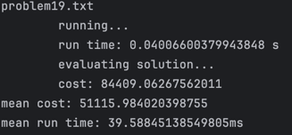

# Vorto Algorithmic Challenge

## Solution - Greedy Insertion Algorithm
Greedy Insertion provides fast solution with relatively optimal results being a great feat for real-time or time-limited application.


Mean cost results are persistent, however, mean time is strongly dependent on environment - I was receiving best results in PyCharm Terminal in clean conda env while Warp Terminal and cluttered Python interpreters yielded slower results.  



## How to run

1. (Optional) Create new lean conda environment to ensure consistency of results and reduce the risk of cluttered Python interpreter slowing down the solution execution. 
    ```
    conda env create -f vorto-nikita-env.yml
    conda activate vorto-nikita
    ```

2. Run the evaluator for Greedy Insertion Algorithm
    ```
    python3 evaluateShared.py --cmd "python3 greedy.py" --problemDir "problemset" 
    ```